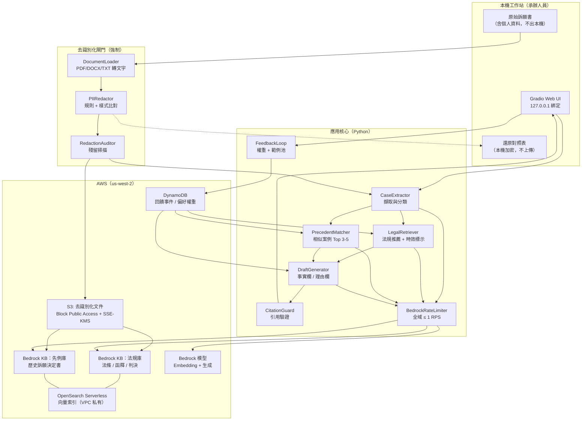
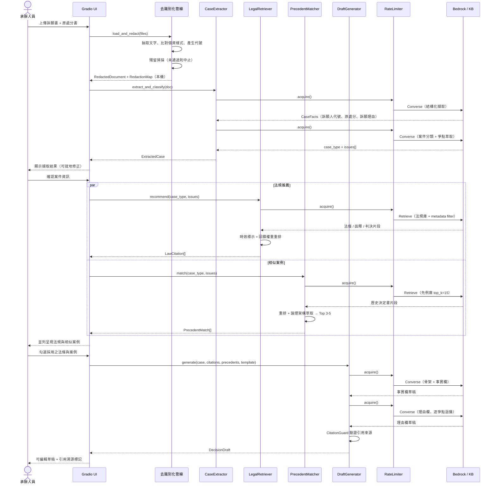
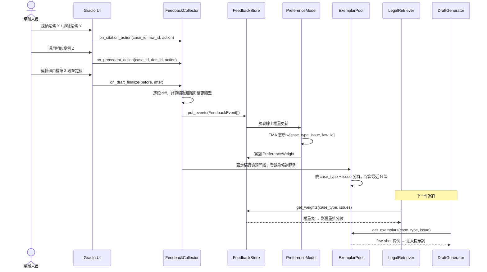
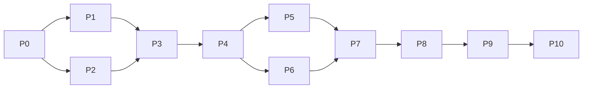

# 設計文件：訴願決定書 AI 輔助撰擬系統（petition-decision-ai-assistant）

## Overview

**概觀**

本系統為新北市政府訴願審議承辦人員設計之 AI 輔助工作台，以 Python + Gradio 建構操作介面，並以 Amazon Bedrock Knowledge Bases（以下簡稱 KB）之 `Retrieve` / `RetrieveAndGenerate` API 作為檢索骨幹。系統涵蓋命題文件所要求之四項核心能力：案件資訊擷取與分類、智能法規推薦、相似案例比對、決定書草稿生成，並針對本市大宗案件類型（洗錢防制法、廢棄物清理法、空氣污染防制法）提供類型化之論理骨架。

系統設計之第二個核心主軸為「依使用者操作持續優化」。承辦人員在介面上對推薦法條之採納／排除、對相似案例之選用、以及對草稿逐段之編輯，皆被結構化記錄為回饋事件，並即時回饋至排序權重與提示詞範例池（few-shot exemplar pool）。此迴路為一等公民元件，不依賴模型微調或大規模訓練，符合黑客松資源限制。

系統設計之第三個核心主軸為「資料去識別化優先」。訴願書與歷史訴願決定書本質上含有訴願人姓名、地址、身分證統一編號等個人資料，而競賽規範明文禁止將個人資料匯入 AWS 帳戶。因此所有文件在寫入 S3 或匯入 KB 之前，必須先經過去識別化階段；還原對照表僅保留於本機加密儲存，永不上傳。此為架構上的強制閘門（mandatory gate），而非事後補強。

---

## Architecture

**架構**

### 系統整體架構



### 資料流分層

| 層級 | 責任 | 是否接觸個人資料 |
|------|------|------------------|
| L0 原始層 | 使用者上傳之訴願書、機關卷證 | 是（僅存記憶體與本機暫存區） |
| L1 去識別層 | 代號化後文字與結構化欄位 | 否 |
| L2 AWS 儲存層 | S3 去識別化文件、KB 向量索引 | 否（強制不變式） |
| L3 推論層 | Bedrock 提示詞與回應 | 否 |
| L4 回饋層 | 回饋事件、偏好權重（僅代號與 ID） | 否 |
| L5 呈現層 | Gradio 顯示時以本機對照表還原代號 | 是（僅在瀏覽器記憶體） |

此分層的關鍵設計決策：**還原（rehydration）只在最外層的呈現階段發生**。AI 全程只看到代號（如 `【訴願人A】`、`【地址1】`），因此草稿生成結果本身也是去識別化的，直到 Gradio 渲染前才代入真實資訊。這同時解決了合規問題與「模型不應記憶個資」的風險。

---

## 循序圖

### 主流程：從上傳訴願書到產出草稿



### 回饋迴路：使用者操作如何優化系統



---

## Components and Interfaces

**元件與介面**

### 元件 1：DocumentLoader

**用途**：將上傳之 PDF / DOCX / TXT 轉為純文字，保留頁碼與段落結構以支援引用溯源。

```python
from typing import Protocol
from pathlib import Path

class DocumentLoader(Protocol):
    def supports(self, path: Path) -> bool:
        """判斷是否支援此檔案格式。"""
        ...

    def load(self, path: Path) -> "SourceDocument":
        """載入並回傳含頁碼標記的結構化文字。"""
        ...
```

**責任**
- 支援 `.pdf`（pypdf）、`.docx`（python-docx）、`.txt`（UTF-8 / Big5 自動偵測）
- 保留 `page_no` 與 `paragraph_index`，供後續引用溯源
- 對掃描檔（無文字層）回報明確錯誤，提示改用可搜尋 PDF
- 不做任何網路呼叫，純本機處理

### 元件 2：PIIRedactor（強制閘門）

**用途**：在任何資料離開本機前，將個人資料替換為穩定代號，並產生僅存本機之還原對照表。

```python
class PIIRedactor(Protocol):
    def redact(self, doc: "SourceDocument") -> tuple["RedactedDocument", "RedactionMap"]:
        """回傳去識別化文件與還原對照表。"""
        ...

    def scan_residual(self, text: str) -> list["PIIFinding"]:
        """掃描殘留個資，回傳所有命中項目。空列表表示通過。"""
        ...
```

**責任**
- 規則式偵測：身分證統一編號、統一編號、居留證號、電話、行動電話、地址、電子郵件、車牌、金融帳號、案號
- 姓名偵測：以「訴願人○○○」「代理人○○○」「代表人○○○」等上下文樣式 + 中文姓名字典輔助
- 代號穩定性：同一實體在同一案件內映射至同一代號（如 `【訴願人A】`）
- 雙重保險：`redact` 完成後必須通過 `scan_residual` 為空，否則整個流程中止並回報命中位置
- 對照表以 AES-GCM 加密後存於本機 `./.local/redaction/`（已納入 `.gitignore`）

**設計理由**：不採用 Amazon Comprehend PII 偵測作為主要手段，因為（a）呼叫 Comprehend 本身就需要把含個資的原文送上雲端，違反規範；（b）繁體中文人名／地址支援有限。因此偵測必須完全在本機完成。

### 元件 3：CaseExtractor

**用途**：從去識別化文件擷取結構化案件資訊、判定案件類型、萃取主要爭點。

```python
class CaseExtractor(Protocol):
    def extract_facts(self, doc: "RedactedDocument") -> "CaseFacts":
        """擷取訴願人資訊、原處分內容、訴願理由。"""
        ...

    def classify(self, facts: "CaseFacts") -> "Classification":
        """判定案件類型與信賴度。"""
        ...

    def extract_issues(self, facts: "CaseFacts", case_type: "CaseType") -> list["Issue"]:
        """萃取主要爭點，並標註爭點類別標籤。"""
        ...
```

**責任**
- 結構化擷取採 Bedrock Converse API 之 tool use（強制 JSON schema），避免自由文字解析
- 分類採兩階段：先以法規名稱／處分機關關鍵字規則快速命中；規則無法判定時才呼叫模型 zero-shot 分類。此設計同時降低 Bedrock 呼叫次數（1 RPS 限制下極為重要）與提高可解釋性
- 爭點標籤採受控詞彙表（controlled vocabulary），使回饋權重可跨案件累積
- 所有欄位皆附 `source_span`（頁碼 + 段落），介面上可點擊跳回原文

### 元件 4：LegalRetriever

**用途**：依案件類型與爭點檢索並推薦法條、行政函釋、法院判決，並標示法規最新修正狀態。

```python
class LegalRetriever(Protocol):
    def recommend(
        self,
        case_type: "CaseType",
        issues: list["Issue"],
        top_k: int = 8,
    ) -> list["LawCitation"]:
        """回傳依融合分數排序之法規推薦，附時效狀態。"""
        ...
```

**責任**
- 呼叫 `bedrock-agent-runtime.retrieve`，帶入 metadata filter（`case_type`、`doc_kind`、`effective_status`）
- 每個爭點各發一次檢索查詢，但共用結果快取，避免重複呼叫
- 時效標示：以 KB metadata 中的 `last_amended_date` 與 `effective_status`（`現行` / `已修正` / `已廢止`）產出 `FreshnessFlag`；引用到非現行條文時以警示色標記
- 融合排序：`final_score = α·kb_score + β·feedback_weight + γ·type_match_bonus - δ·staleness_penalty`
- 回傳結果一律附 `source_uri` 與原文片段，供 CitationGuard 與 UI 溯源

### 元件 5：PrecedentMatcher

**用途**：從歷史訴願決定書庫比對最相似之 3 至 5 件案例，並萃取其論理架構供參考。

```python
class PrecedentMatcher(Protocol):
    def match(
        self,
        case_type: "CaseType",
        issues: list["Issue"],
        limit: int = 5,
    ) -> list["PrecedentMatch"]:
        """回傳 Top-N 相似歷史決定書及其論理架構摘要。"""
        ...
```

**責任**
- 以 `retrieve` 取回較大候選集（`top_k=15`），再以爭點重疊度、處分法條重疊度、回饋權重重排，最後取 3-5 件
- 同一份決定書之多個片段需先聚合（group by `document_id`），避免同一案例佔滿名次
- 論理架構萃取：從決定書片段辨識「事實欄 / 理由欄 / 主文」段落，輸出可比對之 outline
- 回傳 `similarity_breakdown`，讓承辦人員理解「為何這件相似」，而非只給一個分數

### 元件 6：DraftGenerator

**用途**：整合案件資訊、採用之法條、選用之相似案例，生成含事實欄與理由欄之決定書草稿。

```python
class DraftGenerator(Protocol):
    def generate(
        self,
        case: "ExtractedCase",
        citations: list["LawCitation"],
        precedents: list["PrecedentMatch"],
        template: "DecisionTemplate",
    ) -> "DecisionDraft":
        """生成決定書草稿，逐段附引用來源。"""
        ...
```

**責任**
- 分段生成：主文 → 事實欄 → 理由欄（逐爭點）→ 教示規定。分段而非一次生成，可降低單次上下文長度、提高可控性，也讓部分失敗可重試
- 教示規定依案件類型與決定結果自動填入定型文字（模板，不經模型生成，確保零錯誤）
- few-shot 範例由 ExemplarPool 依 `case_type` + `issue_tag` 動態注入
- 每段輸出附 `citation_refs`，交由 CitationGuard 驗證
- 草稿明確標記為「AI 生成草稿，須經承辦人員審核」，並在匯出檔案中保留此標記

### 元件 7：CitationGuard

**用途**：驗證草稿中所有法規引用皆源自實際檢索結果，阻斷幻覺引用。

```python
class CitationGuard(Protocol):
    def verify(
        self,
        draft: "DecisionDraft",
        allowed: list["LawCitation"],
    ) -> "VerificationReport":
        """比對草稿引用與許可清單，回報未授權或失效引用。"""
        ...
```

**責任**
- 以正規表示式擷取草稿中所有法規引用字串（如「廢棄物清理法第 27 條第 11 款」）
- 正規化後比對 `allowed` 清單；未命中者標記為 `UNVERIFIED` 並在 UI 以紅框呈現
- 引用到 `已廢止` / `已修正` 條文者標記為 `STALE`
- 不自動刪除可疑引用，而是標記後交由承辦人員判斷。設計理由：法律文書的最終責任在人，系統不應靜默修改內容

### 元件 8：FeedbackLoop（依使用者操作優化，一等公民）

**用途**：擷取承辦人員操作訊號，即時更新排序權重與提示詞範例池。

```python
class FeedbackCollector(Protocol):
    def on_citation_action(
        self, case_id: str, law_id: str, action: "FeedbackAction"
    ) -> None: ...

    def on_precedent_action(
        self, case_id: str, document_id: str, action: "FeedbackAction"
    ) -> None: ...

    def on_draft_finalize(
        self, case_id: str, before: "DecisionDraft", after: "DecisionDraft"
    ) -> None:
        """逐段 diff，產生段落級編輯訊號。"""
        ...

class PreferenceModel(Protocol):
    def weight(self, case_type: "CaseType", issue_tag: str, item_id: str) -> float:
        """回傳 [0, 1] 區間之偏好權重，未見過的項目回傳中性值 0.5。"""
        ...

    def update(self, event: "FeedbackEvent") -> None:
        """以指數移動平均線上更新權重。"""
        ...

class ExemplarPool(Protocol):
    def register(self, case_type: "CaseType", issue_tag: str, exemplar: "Exemplar") -> None: ...
    def get(self, case_type: "CaseType", issue_tag: str, n: int = 3) -> list["Exemplar"]: ...
```

**責任**
- 三種訊號來源：
  1. **明示訊號**：採納 / 排除 / 標記不相關（按鈕點擊）
  2. **隱含訊號**：草稿段落之編輯距離、被整段刪除、被整段保留
  3. **結果訊號**：草稿定稿所耗時間、最終是否採用系統建議之論理架構
- 權重更新採 EMA：`w ← (1-η)·w + η·reward`，`reward ∈ {0, 1}`，`η = 0.2`。選擇 EMA 而非訓練模型，是為了符合「避免大規模訓練」的競賽限制，同時取得即時生效的優化效果
- 冷啟動：未見過的項目權重為中性 0.5，不影響原始 KB 排序
- 範例池只收錄「編輯距離低於門檻」之定稿段落，即模型產出已接近可用者，避免把壞範例餵回系統
- 所有回饋事件僅含代號與 ID，不含個人資料

### 元件 9：BedrockRateLimiter（跨切面）

**用途**：全域限制 Bedrock 請求速率於每秒 1 次以下，並提供退避重試。

```python
class RateLimiter(Protocol):
    def acquire(self, timeout_s: float | None = None) -> None:
        """阻塞至可安全發出請求為止。逾時則拋出 RateLimitTimeout。"""
        ...
```

**責任**
- 單一進程內以 token bucket 實作，`capacity=1`、`refill_interval=1.05s`（留 5% 安全邊際）
- 以 `threading.Lock` 保護，確保 Gradio 多執行緒事件處理下仍為全域序列化
- 搭配 `tenacity` 對 `ThrottlingException`、`ServiceUnavailableException` 做指數退避 + jitter 重試（最多 5 次）
- 所有 Bedrock / KB 呼叫必須經此閘門，不得有旁路。以單一 `BedrockGateway` 封裝 boto3 client，防止直接呼叫

### 元件 10：Gradio UI

**用途**：承辦人員之單一工作介面。

**版面配置**
- 分頁 1「案件匯入」：檔案上傳、去識別化結果預覽、個資殘留掃描報告
- 分頁 2「案件資訊」：擷取欄位表單（可就地修正）、案件類型與信賴度、爭點清單
- 分頁 3「法規與案例」：左欄法規推薦（附時效徽章與採納／排除按鈕），右欄相似案例（附相似度分解與論理架構 outline）
- 分頁 4「草稿」：分段可編輯草稿、引用溯源標記、CitationGuard 警示、匯出 DOCX
- 分頁 5「成效」：採納率、平均編輯距離、平均定稿時間之趨勢圖，用以驗證優化迴路確有作用

**安全設定**
- `server_name="127.0.0.1"`、`share=False`。Gradio 預設不含身分驗證機制，若後續需多人使用，必須置於 ALB + Cognito 之後，或以 SSH 通道存取。**絕不可直接將 Gradio 埠開放至 0.0.0.0/0**
- 上傳檔案大小與副檔名白名單限制
- 顯示層還原個資時，不寫入任何伺服端日誌

---

## Data Models

**資料模型**

### 列舉與基礎型別

```python
from __future__ import annotations
from dataclasses import dataclass, field
from datetime import date, datetime
from enum import Enum


class CaseType(str, Enum):
    """案件類型（大宗類型優先，其餘歸入 OTHER）。"""
    MONEY_LAUNDERING = "洗錢防制法"
    WASTE_DISPOSAL = "廢棄物清理法"
    AIR_POLLUTION = "空氣污染防制法"
    OTHER = "其他"


class DocKind(str, Enum):
    """法規庫文件種類。"""
    STATUTE = "法條"
    INTERPRETATION = "行政函釋"
    JUDGMENT = "法院判決"
    PRECEDENT = "訴願決定書"


class EffectiveStatus(str, Enum):
    """法規效力狀態。"""
    CURRENT = "現行"
    AMENDED = "已修正"
    REPEALED = "已廢止"
    UNKNOWN = "未確認"


class FeedbackAction(str, Enum):
    ACCEPT = "採納"
    REJECT = "排除"
    IRRELEVANT = "標記不相關"
    EDIT = "編輯"
    KEEP = "整段保留"
    DELETE = "整段刪除"


class CitationStatus(str, Enum):
    VERIFIED = "已驗證"
    UNVERIFIED = "未在檢索結果中"
    STALE = "引用非現行條文"
```

### 去識別化相關模型

```python
@dataclass(frozen=True)
class TextSpan:
    """文字位置，用於引用溯源。"""
    page_no: int
    paragraph_index: int
    char_start: int
    char_end: int


@dataclass(frozen=True)
class SourceDocument:
    """原始文件（含個人資料，僅存於本機記憶體）。"""
    doc_id: str
    filename: str
    paragraphs: tuple[str, ...]
    page_of_paragraph: tuple[int, ...]


@dataclass(frozen=True)
class PIIFinding:
    """個資命中項目。"""
    pii_type: str          # 例：ROC_ID, PHONE, ADDRESS, PERSON_NAME
    matched_text: str
    span: TextSpan
    confidence: float      # [0, 1]


@dataclass(frozen=True)
class RedactionMap:
    """代號 → 原文之還原對照表（本機加密儲存，永不上傳）。"""
    doc_id: str
    mapping: dict[str, str]         # {"【訴願人A】": "王小明", ...}
    created_at: datetime

    # 驗證規則：
    # - mapping 為單射（不同代號不得對應同一原文）
    # - 代號格式必須符合 r"^【[\u4e00-\u9fa5]+[A-Z]\d*】$"
    # - 此物件不得被序列化至任何 AWS 服務


@dataclass(frozen=True)
class RedactedDocument:
    """去識別化文件（可安全上傳 S3 / 匯入 KB）。"""
    doc_id: str
    paragraphs: tuple[str, ...]
    page_of_paragraph: tuple[int, ...]
    redacted_types: frozenset[str]
    residual_findings: tuple[PIIFinding, ...]   # 必須為空才可外送
```

### 案件資訊模型

```python
@dataclass(frozen=True)
class Petitioner:
    """訴願人資訊（去識別化後）。"""
    alias: str                      # 例："【訴願人A】"
    entity_kind: str                # "自然人" | "法人" | "非法人團體"
    has_agent: bool
    agent_alias: str | None = None


@dataclass(frozen=True)
class OriginalDisposition:
    """原處分內容。"""
    agency: str                     # 處分機關
    doc_number_alias: str           # 處分書字號（代號化）
    disposition_date: date | None
    legal_basis: tuple[str, ...]    # 處分所引法條原文字串
    sanction_summary: str           # 處分內容摘要（如罰鍰金額級距）
    source_spans: tuple[TextSpan, ...]


@dataclass(frozen=True)
class PetitionGround:
    """訴願理由（單一主張）。"""
    ground_index: int
    summary: str
    claimed_basis: tuple[str, ...]  # 訴願人主張之法規依據
    source_spans: tuple[TextSpan, ...]


@dataclass(frozen=True)
class Issue:
    """爭點。"""
    issue_id: str
    tag: str                        # 受控詞彙，例："裁罰額度妥適性"
    statement: str                  # 爭點敘述
    related_ground_indices: tuple[int, ...]
    priority: int                   # 1 為最主要


@dataclass(frozen=True)
class CaseFacts:
    petitioner: Petitioner
    disposition: OriginalDisposition
    grounds: tuple[PetitionGround, ...]
    raw_text_ref: str               # RedactedDocument.doc_id


@dataclass(frozen=True)
class Classification:
    case_type: CaseType
    confidence: float               # [0, 1]
    method: str                     # "rule" | "model"
    rationale: str


@dataclass(frozen=True)
class ExtractedCase:
    case_id: str
    facts: CaseFacts
    classification: Classification
    issues: tuple[Issue, ...]
    extracted_at: datetime
```

**驗證規則**
- `Classification.confidence < 0.7` 時，UI 必須要求承辦人員手動確認案件類型
- `issues` 不得為空；若模型未萃取出爭點，退回以訴願理由逐項作為爭點
- 所有 `source_spans` 必須指向存在的 `paragraph_index`

### 檢索與推薦模型

```python
@dataclass(frozen=True)
class FreshnessFlag:
    status: EffectiveStatus
    last_amended_date: date | None
    note: str                       # 例："112.06.14 修正，本案處分時點適用舊法"


@dataclass(frozen=True)
class LawCitation:
    """單一法規推薦項目。"""
    law_id: str                     # 正規化識別碼，例："廢棄物清理法#27#11"
    display_name: str               # "廢棄物清理法第 27 條第 11 款"
    doc_kind: DocKind
    excerpt: str                    # KB 回傳原文片段
    source_uri: str                 # S3 URI
    kb_score: float                 # KB 原始相關性分數
    feedback_weight: float          # 來自 PreferenceModel，[0, 1]
    final_score: float              # 融合分數
    freshness: FreshnessFlag
    matched_issue_ids: tuple[str, ...]


@dataclass(frozen=True)
class ReasoningOutline:
    """歷史決定書之論理架構。"""
    fact_section_summary: str
    reasoning_steps: tuple[str, ...]
    conclusion: str                 # 例："駁回" | "撤銷原處分"


@dataclass(frozen=True)
class SimilarityBreakdown:
    """相似度分解，供承辦人員理解排序依據。"""
    issue_overlap: float            # [0, 1]
    law_overlap: float              # [0, 1]
    semantic_score: float           # [0, 1]
    feedback_weight: float          # [0, 1]


@dataclass(frozen=True)
class PrecedentMatch:
    document_id: str
    case_number_alias: str          # 案號（代號化）
    decision_date: date | None
    case_type: CaseType
    outline: ReasoningOutline
    cited_laws: tuple[str, ...]
    breakdown: SimilarityBreakdown
    final_score: float
    source_uri: str
```

### 草稿模型

```python
@dataclass(frozen=True)
class DecisionTemplate:
    """類型化決定書骨架。"""
    case_type: CaseType
    main_text_pattern: str          # 主文定型句
    fact_section_guide: str         # 事實欄撰寫指引
    reasoning_section_guide: str    # 理由欄撰寫指引
    instruction_clause: str         # 教示規定定型文字（不經模型生成）


@dataclass(frozen=True)
class DraftSection:
    section_id: str                 # "main" | "facts" | "reasoning:<issue_id>" | "instruction"
    title: str
    content: str
    citation_refs: tuple[str, ...]  # 對應 LawCitation.law_id
    precedent_refs: tuple[str, ...] # 對應 PrecedentMatch.document_id
    generated: bool                 # False 表示為模板填入，非模型生成


@dataclass(frozen=True)
class DecisionDraft:
    case_id: str
    template_case_type: CaseType
    sections: tuple[DraftSection, ...]
    generated_at: datetime
    disclaimer: str = "本文為 AI 生成草稿，須經承辦人員審核確認後方得使用。"


@dataclass(frozen=True)
class CitationIssue:
    section_id: str
    citation_text: str
    status: CitationStatus
    detail: str


@dataclass(frozen=True)
class VerificationReport:
    passed: bool
    issues: tuple[CitationIssue, ...]
```

### 回饋與優化模型

```python
@dataclass(frozen=True)
class FeedbackEvent:
    """單一回饋事件（僅含代號與 ID，無個人資料）。"""
    event_id: str
    case_id: str
    case_type: CaseType
    issue_tag: str | None
    target_kind: str                # "citation" | "precedent" | "draft_section"
    target_id: str                  # law_id / document_id / section_id
    action: FeedbackAction
    edit_distance_ratio: float | None   # [0, 1]，僅 EDIT 事件有值
    occurred_at: datetime


@dataclass
class PreferenceWeight:
    """線上更新之偏好權重。"""
    case_type: CaseType
    issue_tag: str
    item_id: str
    weight: float                   # [0, 1]，中性值 0.5
    sample_count: int
    updated_at: datetime


@dataclass(frozen=True)
class Exemplar:
    """few-shot 範例（取自低編輯距離之定稿段落）。"""
    exemplar_id: str
    case_type: CaseType
    issue_tag: str
    input_summary: str              # 去識別化案件摘要
    output_text: str                # 定稿段落
    edit_distance_ratio: float
    registered_at: datetime


@dataclass(frozen=True)
class OptimizationMetrics:
    """成效指標，用以驗證優化迴路有效。"""
    window_start: datetime
    window_end: datetime
    citation_accept_rate: float     # 採納率
    precedent_accept_rate: float
    mean_edit_distance_ratio: float # 越低越好
    mean_time_to_finalize_s: float
    case_count: int
```

### KB 文件 metadata 結構

Bedrock KB 以同名 `.metadata.json` 檔攜帶可過濾欄位。

```python
# 法規庫：s3://<bucket>/law/廢棄物清理法.txt.metadata.json
LAW_METADATA_SCHEMA = {
    "metadataAttributes": {
        "doc_kind": "法條",              # DocKind
        "law_name": "廢棄物清理法",
        "article": "27",
        "effective_status": "現行",       # EffectiveStatus
        "last_amended_date": "2023-06-14",
        "applicable_case_types": "廢棄物清理法",
        "issue_tags": "違法棄置;裁罰額度妥適性",
    }
}

# 先例庫：s3://<bucket>/precedent/<案號代號>.txt.metadata.json
PRECEDENT_METADATA_SCHEMA = {
    "metadataAttributes": {
        "doc_kind": "訴願決定書",
        "case_type": "空氣污染防制法",
        "decision_year": "114",
        "conclusion": "駁回",
        "cited_laws": "空氣污染防制法#20#1;空氣污染防制法#62",
        "issue_tags": "排放標準認定;採樣程序合法性",
    }
}
```

**設計決策**：採用單一 S3 bucket 內分 `law/` 與 `precedent/` 兩個前綴，但建立**兩個獨立的 KB**（各自 data source 指向不同前綴）。理由：法規檢索與先例檢索的最佳 chunk 大小差異很大（法條宜細切，決定書宜按段落／欄位切），分開建置可各自調參，且避免 metadata filter 失效時互相污染結果。

---

## 關鍵函式與形式化規格

以下為低階設計。因原始需求明確指定 Python，所有演算法一律以 Python 表述，並以前置條件（preconditions）、後置條件（postconditions）、迴圈不變式（loop invariants）作為形式化規格。

### 函式 1：`redact_document`

```python
def redact_document(doc: SourceDocument) -> tuple[RedactedDocument, RedactionMap]:
    ...
```

**前置條件**
- `doc.paragraphs` 非空，且每個元素為 `str`
- `len(doc.paragraphs) == len(doc.page_of_paragraph)`
- 呼叫端尚未將 `doc` 任何內容寫入磁碟或網路

**後置條件**
- `len(result.paragraphs) == len(doc.paragraphs)`（段落數不變，維持溯源對應）
- `result.residual_findings == ()`；若非空則不回傳而拋出 `ResidualPIIError`
- `redaction_map.mapping` 為單射：`len(set(mapping.values())) == len(mapping)`
- 對所有 `alias in mapping`：`any(alias in p for p in result.paragraphs)` 為真（不產生未使用的代號）
- 可逆性：`restore(result, redaction_map) == doc`
- `doc` 未被變更（輸入為 frozen dataclass，天然不可變）

**迴圈不變式**（逐段處理迴圈）
- 已處理段落中不存在任何 `pii_type` 命中
- `alias_counter` 對每個 `(pii_type, original_text)` 組合維持唯一且穩定之代號
- 已建立之 `mapping` 始終為單射

### 函式 2：`RateLimiter.acquire`

```python
def acquire(self, timeout_s: float | None = None) -> None:
    ...
```

**前置條件**
- `self.refill_interval >= 1.05`（秒），確保實測速率嚴格低於 1 RPS
- `timeout_s is None or timeout_s > 0`

**後置條件**
- 函式返回後，呼叫端在 `refill_interval` 內為唯一被授權發出 Bedrock 請求者
- 任意 1 秒滑動窗內，本進程對 Bedrock 端點之請求數 ≤ 1
- 逾時則拋出 `RateLimitTimeout`，且不消耗 token

**迴圈不變式**（等待迴圈）
- `0 <= self._tokens <= self.capacity`
- `self._last_refill <= time.monotonic()`
- 持有 `self._lock` 期間不執行任何阻塞式網路呼叫（避免鎖持有時間過長）

### 函式 3：`fuse_scores`

```python
def fuse_scores(
    citation: LawCitation,
    weights: FusionWeights,
) -> float:
    ...
```

**前置條件**
- `0.0 <= citation.kb_score <= 1.0`
- `0.0 <= citation.feedback_weight <= 1.0`
- `weights.alpha + weights.beta + weights.gamma == 1.0` 且各項 `>= 0`
- `0.0 <= weights.delta <= 1.0`

**後置條件**
- 回傳值 `∈ [0.0, 1.0]`（經 clamp）
- 對 `feedback_weight` 單調遞增：其他條件相同時，被採納次數較多者分數不低於較少者
- `feedback_weight == 0.5`（冷啟動中性值）時，排序結果與純 KB 分數排序一致
- 純函式，無副作用

**迴圈不變式**：不適用（無迴圈）

### 函式 4：`PreferenceModel.update`

```python
def update(self, event: FeedbackEvent) -> None:
    ...
```

**前置條件**
- `event.action` 屬於已定義之 `FeedbackAction`
- 若 `event.action == FeedbackAction.EDIT`，則 `event.edit_distance_ratio is not None` 且 `∈ [0, 1]`
- `event` 不含任何個人資料欄位

**後置條件**
- `weight(case_type, issue_tag, target_id) ∈ [0.0, 1.0]`
- `sample_count` 恰增加 1
- `ACCEPT` / `KEEP` 事件使權重不下降；`REJECT` / `IRRELEVANT` / `DELETE` 事件使權重不上升
- 更新為冪等於 `event_id`：相同 `event_id` 重複套用不改變結果
- 收斂性：對固定 reward `r` 連續套用 n 次，`|w_n - r| = (1-η)^n · |w_0 - r| → 0`

**迴圈不變式**：不適用（單筆更新）

### 函式 5：`CitationGuard.verify`

```python
def verify(
    self,
    draft: DecisionDraft,
    allowed: list[LawCitation],
) -> VerificationReport:
    ...
```

**前置條件**
- `draft.sections` 非空
- `allowed` 中每個 `law_id` 皆已正規化（`normalize_law_id` 之固定點）

**後置條件**
- `report.passed == all(i.status == CitationStatus.VERIFIED for i in report.issues)`
- 草稿中每個被擷取之引用字串，在 `report.issues` 中恰出現一次
- 不修改 `draft`（純函式）
- 對所有 `citation ∉ allowed_ids`：狀態為 `UNVERIFIED`
- 對所有 `citation ∈ allowed_ids` 且對應 `freshness.status != CURRENT`：狀態為 `STALE`

**迴圈不變式**（逐段掃描迴圈）
- 已掃描段落之所有引用皆已分類完畢（無 pending 狀態）
- `seen_citations` 集合單調增長

### 函式 6：`PrecedentMatcher.match`

```python
def match(
    self,
    case_type: CaseType,
    issues: list[Issue],
    limit: int = 5,
) -> list[PrecedentMatch]:
    ...
```

**前置條件**
- `issues` 非空
- `3 <= limit <= 5`（命題文件要求 Top 3-5）
- 先例庫 KB 已完成 ingestion 且狀態為可用

**後置條件**
- `len(result) <= limit`
- 結果依 `final_score` 遞減排序
- `document_id` 不重複（同一決定書之多片段已聚合）
- 對所有 `m in result`：`m.case_type == case_type` 或 `case_type == CaseType.OTHER`
- 對所有 `m in result`：`m.breakdown` 之各分項 `∈ [0, 1]`
- 檢索結果為空時回傳 `[]`，不拋出例外

**迴圈不變式**（聚合與重排迴圈）
- `by_document` 字典中每個 key 對應該文件目前最高之語意分數
- 已處理候選數 + 待處理候選數 = 候選總數

---

## 演算法設計

### 演算法 1：去識別化主流程

```python
def redact_document(doc: SourceDocument) -> tuple[RedactedDocument, RedactionMap]:
    """去識別化強制閘門：任何資料外送前必須通過此函式。"""
    assert doc.paragraphs, "前置條件：文件不得為空"
    assert len(doc.paragraphs) == len(doc.page_of_paragraph)

    detectors = build_detectors()          # ROC_ID, PHONE, ADDRESS, PERSON_NAME, ...
    alias_of: dict[tuple[str, str], str] = {}   # (pii_type, original) -> alias
    counters: dict[str, int] = {}
    out_paragraphs: list[str] = []

    for para_idx, para in enumerate(doc.paragraphs):
        # 迴圈不變式：out_paragraphs 中所有段落已無個資命中
        #             alias_of 為單射且代號穩定
        text = para
        findings = sorted(
            (f for d in detectors for f in d.find(text, para_idx)),
            key=lambda f: f.span.char_start,
            reverse=True,                   # 由後往前替換，避免位移失效
        )
        for f in findings:
            key = (f.pii_type, f.matched_text)
            if key not in alias_of:
                counters[f.pii_type] = counters.get(f.pii_type, 0) + 1
                alias_of[key] = make_alias(f.pii_type, counters[f.pii_type])
            text = (
                text[: f.span.char_start]
                + alias_of[key]
                + text[f.span.char_end :]
            )
        out_paragraphs.append(text)

    joined = "\n".join(out_paragraphs)
    residual = scan_residual(joined)
    if residual:
        # 設計決策：寧可中止，不可外送。此處不做「盡力而為」處理。
        raise ResidualPIIError(findings=residual)

    redacted = RedactedDocument(
        doc_id=doc.doc_id,
        paragraphs=tuple(out_paragraphs),
        page_of_paragraph=doc.page_of_paragraph,
        redacted_types=frozenset(t for t, _ in alias_of),
        residual_findings=(),
    )
    mapping = {alias: original for (_, original), alias in alias_of.items()}
    assert len(set(mapping.values())) == len(mapping), "後置條件：mapping 必須為單射"

    return redacted, RedactionMap(doc.doc_id, mapping, datetime.now())
```

**設計要點**：由後往前替換是關鍵細節。若由前往後替換，先前替換造成的長度變化會使後續 `char_start` 全部失效。

### 演算法 2：Bedrock 全域速率閘門

```python
class TokenBucketRateLimiter:
    """全域 token bucket，確保 Bedrock 請求嚴格低於 1 RPS。"""

    def __init__(self, capacity: int = 1, refill_interval: float = 1.05) -> None:
        assert refill_interval >= 1.05, "前置條件：須留安全邊際"
        self.capacity = capacity
        self.refill_interval = refill_interval
        self._tokens = float(capacity)
        self._last_refill = time.monotonic()
        self._lock = threading.Lock()

    def acquire(self, timeout_s: float | None = None) -> None:
        deadline = None if timeout_s is None else time.monotonic() + timeout_s
        while True:
            # 迴圈不變式：0 <= self._tokens <= self.capacity
            #             self._last_refill <= time.monotonic()
            with self._lock:
                now = time.monotonic()
                elapsed = now - self._last_refill
                refilled = elapsed / self.refill_interval
                if refilled > 0:
                    self._tokens = min(self.capacity, self._tokens + refilled)
                    self._last_refill = now
                if self._tokens >= 1.0:
                    self._tokens -= 1.0
                    return                  # 後置條件：呼叫端已取得發送權
                wait = (1.0 - self._tokens) * self.refill_interval
            if deadline is not None and time.monotonic() + wait > deadline:
                raise RateLimitTimeout(waited_for=timeout_s)
            time.sleep(min(wait, 0.25))     # 分段睡眠，維持 UI 可回應性
```

**設計要點**：睡眠發生在鎖之外，且分段進行。若在持有鎖時睡眠，Gradio 的其他事件執行緒會被整段阻塞。

### 演算法 3：Bedrock 統一出口閘道

```python
class BedrockGateway:
    """所有 Bedrock / KB 呼叫的唯一出口。禁止任何旁路直接使用 boto3 client。"""

    def __init__(self, cfg: AppConfig, limiter: RateLimiter) -> None:
        self._runtime = boto3.client("bedrock-runtime", region_name=cfg.region)
        self._agent = boto3.client("bedrock-agent-runtime", region_name=cfg.region)
        self._limiter = limiter
        self._cache: dict[str, object] = {}

    @retry(
        retry=retry_if_exception_type(ThrottlingError),
        wait=wait_exponential_jitter(initial=1.0, max=30.0),
        stop=stop_after_attempt(5),
        reraise=True,
    )
    def retrieve(
        self,
        kb_id: str,
        query: str,
        metadata_filter: dict | None = None,
        top_k: int = 8,
    ) -> list[RetrievedChunk]:
        cache_key = hash_key("retrieve", kb_id, query, metadata_filter, top_k)
        if cache_key in self._cache:
            return self._cache[cache_key]    # 快取命中不消耗速率預算

        self._limiter.acquire(timeout_s=120)
        vsc: dict = {"numberOfResults": top_k}
        if metadata_filter:
            vsc["filter"] = metadata_filter

        resp = self._agent.retrieve(
            knowledgeBaseId=kb_id,
            retrievalQuery={"text": query},
            retrievalConfiguration={"vectorSearchConfiguration": vsc},
        )
        chunks = [
            RetrievedChunk(
                text=r["content"]["text"],
                score=float(r.get("score", 0.0)),
                source_uri=r["location"]["s3Location"]["uri"],
                metadata=r.get("metadata", {}),
            )
            for r in resp.get("retrievalResults", [])
        ]
        self._cache[cache_key] = chunks
        return chunks

    def converse_json(
        self,
        prompt: str,
        tool_schema: dict,
        system: str | None = None,
    ) -> dict:
        """以 tool use 強制結構化輸出，避免解析自由文字。"""
        self._limiter.acquire(timeout_s=120)
        resp = self._runtime.converse(
            modelId=self._cfg.generation_model_id,
            messages=[{"role": "user", "content": [{"text": prompt}]}],
            system=[{"text": system}] if system else [],
            toolConfig={
                "tools": [{"toolSpec": tool_schema}],
                "toolChoice": {"tool": {"name": tool_schema["name"]}},
            },
            inferenceConfig={"temperature": 0.2, "maxTokens": 4096},
        )
        return extract_tool_input(resp)
```

**設計要點**
- 快取層位於速率閘門之前。1 RPS 限制下，避免重複呼叫比任何優化都重要
- `toolChoice` 強制指定工具，使模型必須輸出符合 schema 的 JSON，不需寫容錯解析器
- `temperature=0.2`：法律文書需要一致性而非創意

### 演算法 4：法規推薦與融合排序

```python
def recommend(
    self,
    case_type: CaseType,
    issues: list[Issue],
    top_k: int = 8,
) -> list[LawCitation]:
    assert issues, "前置條件：爭點不得為空"

    by_law: dict[str, LawCitation] = {}

    for issue in issues:
        # 迴圈不變式：by_law 中每個 law_id 保有其最高 kb_score 之片段
        query = build_law_query(case_type, issue)
        chunks = self._gw.retrieve(
            kb_id=self._cfg.law_kb_id,
            query=query,
            metadata_filter={
                "andAll": [
                    {"in": {"key": "applicable_case_types",
                            "value": [case_type.value, "通用"]}},
                    {"notEquals": {"key": "effective_status",
                                   "value": EffectiveStatus.REPEALED.value}},
                ]
            },
            top_k=top_k * 2,
        )
        for ch in chunks:
            law_id = normalize_law_id(ch.metadata)
            fw = self._prefs.weight(case_type, issue.tag, law_id)
            cand = build_citation(ch, law_id, fw, issue.issue_id)
            prev = by_law.get(law_id)
            if prev is None or cand.kb_score > prev.kb_score:
                by_law[law_id] = merge_matched_issues(prev, cand)

    scored = [
        replace(c, final_score=fuse_scores(c, self._cfg.fusion_weights))
        for c in by_law.values()
    ]
    scored.sort(key=lambda c: c.final_score, reverse=True)
    result = scored[:top_k]

    assert all(0.0 <= c.final_score <= 1.0 for c in result)
    return result


def fuse_scores(citation: LawCitation, w: FusionWeights) -> float:
    """融合 KB 相關性、使用者回饋權重、類型契合度，並懲罰非現行條文。"""
    type_bonus = 1.0 if citation.matched_issue_ids else 0.0
    staleness = 0.0 if citation.freshness.status is EffectiveStatus.CURRENT else 1.0
    raw = (
        w.alpha * citation.kb_score
        + w.beta * citation.feedback_weight
        + w.gamma * type_bonus
        - w.delta * staleness
    )
    return max(0.0, min(1.0, raw))
```

**設計要點**：`notEquals REPEALED` 在檢索階段就排除已廢止條文，而非事後過濾。這樣 `top_k` 名額不會被無效條文佔用。已修正條文則保留但扣分，因為處分時點可能適用舊法，承辦人員需要看到它。

### 演算法 5：相似案例比對（聚合 + 重排）

```python
def match(
    self,
    case_type: CaseType,
    issues: list[Issue],
    limit: int = 5,
) -> list[PrecedentMatch]:
    assert issues, "前置條件：爭點不得為空"
    assert 3 <= limit <= 5, "前置條件：命題要求 Top 3-5"

    issue_tags = {i.tag for i in issues}
    query = build_precedent_query(case_type, issues)

    chunks = self._gw.retrieve(
        kb_id=self._cfg.precedent_kb_id,
        query=query,
        metadata_filter={"equals": {"key": "case_type", "value": case_type.value}},
        top_k=15,
    )
    if not chunks:
        return []                            # 後置條件：空結果不拋例外

    by_doc: dict[str, list[RetrievedChunk]] = {}
    for ch in chunks:
        # 迴圈不變式：by_doc 依 document_id 聚合，已處理片段數單調增加
        by_doc.setdefault(ch.metadata["document_id"], []).append(ch)

    matches: list[PrecedentMatch] = []
    for doc_id, group in by_doc.items():
        meta = group[0].metadata
        doc_tags = set(split_multi(meta.get("issue_tags", "")))
        doc_laws = set(split_multi(meta.get("cited_laws", "")))

        breakdown = SimilarityBreakdown(
            issue_overlap=jaccard(issue_tags, doc_tags),
            law_overlap=jaccard(current_case_laws(issues), doc_laws),
            semantic_score=max(c.score for c in group),
            feedback_weight=self._prefs.weight(case_type, "__doc__", doc_id),
        )
        matches.append(
            PrecedentMatch(
                document_id=doc_id,
                case_number_alias=meta.get("case_number_alias", doc_id),
                decision_date=parse_date(meta.get("decision_date")),
                case_type=case_type,
                outline=extract_outline(group),   # 純文字解析，不呼叫模型
                cited_laws=tuple(sorted(doc_laws)),
                breakdown=breakdown,
                final_score=weighted_sum(breakdown, self._cfg.similarity_weights),
                source_uri=group[0].source_uri,
            )
        )

    matches.sort(key=lambda m: m.final_score, reverse=True)
    result = matches[:limit]
    assert len({m.document_id for m in result}) == len(result), "後置條件：文件不重複"
    return result
```

**設計要點**：`extract_outline` 以段落標題正規表示式（「事實」「理由」「主文」）解析，不呼叫模型。在 1 RPS 限制下，能用字串處理解決的就不該花掉一次 Bedrock 呼叫。

### 演算法 6：草稿分段生成

```python
def generate(
    self,
    case: ExtractedCase,
    citations: list[LawCitation],
    precedents: list[PrecedentMatch],
    template: DecisionTemplate,
) -> DecisionDraft:
    sections: list[DraftSection] = []

    # 步驟 1：主文（模板填入，不經模型 → 零幻覺）
    sections.append(
        DraftSection(
            section_id="main",
            title="主文",
            content=template.main_text_pattern.format(
                conclusion=infer_conclusion_placeholder()
            ),
            citation_refs=(),
            precedent_refs=(),
            generated=False,
        )
    )

    # 步驟 2：事實欄（模型生成，僅依據已擷取事實，禁止引入外部資訊）
    facts_text = self._gw.converse_json(
        prompt=build_facts_prompt(case, template),
        tool_schema=FACTS_SCHEMA,
        system=SYSTEM_FACTS_ONLY,
    )["fact_section"]
    sections.append(
        DraftSection("facts", "事實", facts_text, (), (), generated=True)
    )

    # 步驟 3：理由欄逐爭點生成
    for issue in case.issues:
        # 迴圈不變式：已生成之理由段落，其引用皆取自 citations 子集
        issue_cites = [c for c in citations if issue.issue_id in c.matched_issue_ids]
        exemplars = self._exemplars.get(case.classification.case_type, issue.tag, n=3)
        out = self._gw.converse_json(
            prompt=build_reasoning_prompt(
                case=case,
                issue=issue,
                citations=issue_cites,
                precedents=precedents,
                template=template,
                exemplars=exemplars,
            ),
            tool_schema=REASONING_SCHEMA,
            system=SYSTEM_CITE_ONLY_PROVIDED,
        )
        sections.append(
            DraftSection(
                section_id=f"reasoning:{issue.issue_id}",
                title=f"理由 — {issue.tag}",
                content=out["reasoning"],
                citation_refs=tuple(out.get("used_law_ids", ())),
                precedent_refs=tuple(p.document_id for p in precedents),
                generated=True,
            )
        )

    # 步驟 4：教示規定（定型文字，不經模型 → 零錯誤）
    sections.append(
        DraftSection(
            section_id="instruction",
            title="教示規定",
            content=template.instruction_clause,
            citation_refs=(),
            precedent_refs=(),
            generated=False,
        )
    )

    return DecisionDraft(
        case_id=case.case_id,
        template_case_type=case.classification.case_type,
        sections=tuple(sections),
        generated_at=datetime.now(),
    )
```

**設計要點**：主文與教示規定刻意不經模型生成。這兩部分是高度定型的法定文字，任何模型幻覺都是嚴重瑕疵，而模板填入可保證正確。模型只負責真正需要語言理解的事實欄與理由欄涵攝。

### 演算法 7：回饋權重線上更新

```python
def update(self, event: FeedbackEvent) -> None:
    assert event.action in FeedbackAction, "前置條件：動作須為已定義列舉"
    if self._store.has_event(event.event_id):
        return                              # 後置條件：對 event_id 冪等

    reward = self._reward_of(event)
    if reward is None:
        return                              # 無方向性訊號，不更新

    key = (event.case_type, event.issue_tag or "__doc__", event.target_id)
    cur = self._store.get_weight(*key)
    w0 = cur.weight if cur else 0.5          # 冷啟動中性值
    n0 = cur.sample_count if cur else 0

    eta = self._cfg.learning_rate            # 0.2
    w1 = (1.0 - eta) * w0 + eta * reward
    w1 = max(0.0, min(1.0, w1))              # 後置條件：權重 ∈ [0, 1]

    if reward >= 0.5:
        assert w1 >= w0 - 1e-9, "後置條件：正向訊號不得使權重下降"
    else:
        assert w1 <= w0 + 1e-9, "後置條件：負向訊號不得使權重上升"

    self._store.put_weight(
        PreferenceWeight(*key, weight=w1, sample_count=n0 + 1,
                         updated_at=datetime.now())
    )
    self._store.mark_event(event.event_id)


def _reward_of(self, event: FeedbackEvent) -> float | None:
    """將使用者操作映射為 [0, 1] 之 reward。"""
    match event.action:
        case FeedbackAction.ACCEPT | FeedbackAction.KEEP:
            return 1.0
        case FeedbackAction.REJECT | FeedbackAction.IRRELEVANT | FeedbackAction.DELETE:
            return 0.0
        case FeedbackAction.EDIT:
            # 編輯幅度越小，代表原始建議越接近可用
            assert event.edit_distance_ratio is not None
            return 1.0 - event.edit_distance_ratio
        case _:
            return None
```

### 演算法 8：草稿 diff 轉回饋訊號

```python
def on_draft_finalize(
    self,
    case_id: str,
    before: DecisionDraft,
    after: DecisionDraft,
) -> None:
    """比對生成草稿與定稿，產生段落級隱含回饋。"""
    before_map = {s.section_id: s for s in before.sections}
    events: list[FeedbackEvent] = []

    for sec in after.sections:
        # 迴圈不變式：每個段落最多產生一筆段落級事件
        orig = before_map.get(sec.section_id)
        if orig is None or not orig.generated:
            continue                        # 模板段落不納入學習訊號

        ratio = edit_distance_ratio(orig.content, sec.content)
        if ratio == 0.0:
            action = FeedbackAction.KEEP
        elif not sec.content.strip():
            action = FeedbackAction.DELETE
        else:
            action = FeedbackAction.EDIT

        issue_tag = parse_issue_tag(sec.section_id)
        events.append(
            FeedbackEvent(
                event_id=uuid4().hex,
                case_id=case_id,
                case_type=after.template_case_type,
                issue_tag=issue_tag,
                target_kind="draft_section",
                target_id=sec.section_id,
                action=action,
                edit_distance_ratio=ratio,
                occurred_at=datetime.now(),
            )
        )
        # 段落中實際保留下來的法條，視為對該法條的正向訊號
        for law_id in orig.citation_refs:
            if law_id_appears(law_id, sec.content):
                events.append(citation_kept_event(case_id, after, issue_tag, law_id))

        # 低編輯距離之段落登錄為 few-shot 範例
        if ratio <= self._cfg.exemplar_threshold and issue_tag:
            self._exemplars.register(
                after.template_case_type,
                issue_tag,
                Exemplar(uuid4().hex, after.template_case_type, issue_tag,
                         summarize_case(case_id), sec.content, ratio, datetime.now()),
            )

    self._store.put_events(events)
    for e in events:
        self._prefs.update(e)
```

**設計要點**：「段落中實際保留下來的法條視為正向訊號」是這個迴圈最有價值的部分。承辦人員不會刻意去按每個法條的採納鈕，但他們的定稿本身就誠實地表達了哪些法條有用。

---

## 使用範例

### 範例 1：端到端處理單一案件（程式化呼叫）

```python
from petition_ai.app import build_container

c = build_container()                       # 依環境變數組裝所有元件

# 1. 去識別化（強制閘門）
source = c.loader.load(Path("./inbox/訴願書_A.pdf"))
redacted, rmap = c.redactor.redact(source)  # 未通過殘留掃描會拋 ResidualPIIError

# 2. 擷取與分類
facts = c.extractor.extract_facts(redacted)
cls = c.extractor.classify(facts)
issues = c.extractor.extract_issues(facts, cls.case_type)
case = ExtractedCase("C-114-0001", facts, cls, tuple(issues), datetime.now())

# 3. 法規推薦與相似案例
citations = c.retriever.recommend(cls.case_type, list(issues), top_k=8)
precedents = c.matcher.match(cls.case_type, list(issues), limit=5)

for cit in citations:
    flag = "" if cit.freshness.status is EffectiveStatus.CURRENT else " [注意時效]"
    print(f"{cit.final_score:.3f}  {cit.display_name}{flag}")

# 4. 草稿生成與引用驗證
template = c.templates.for_case_type(cls.case_type)
draft = c.generator.generate(case, citations, precedents, template)
report = c.guard.verify(draft, citations)
if not report.passed:
    for issue in report.issues:
        print(f"[{issue.status.value}] {issue.section_id}: {issue.citation_text}")

# 5. 呈現層才還原個資
display_text = c.rehydrator.restore(draft, rmap)
```

### 範例 2：Gradio 介面接線（含回饋擷取）

```python
import gradio as gr

def on_upload(files):
    docs = [c.loader.load(Path(f)) for f in files]
    redacted, rmap = c.redactor.redact(merge_documents(docs))
    state = SessionState(redacted=redacted, rmap=rmap)
    return state, redaction_report_html(redacted)

def on_analyze(state):
    case = analyze_case(c, state.redacted)
    citations = c.retriever.recommend(case.classification.case_type,
                                      list(case.issues))
    precedents = c.matcher.match(case.classification.case_type,
                                 list(case.issues))
    state = replace(state, case=case, citations=citations, precedents=precedents)
    return state, citations_table(citations), precedents_table(precedents)

def on_citation_accept(state, law_id):
    """使用者操作即時進入優化迴路。"""
    c.feedback.on_citation_action(state.case.case_id, law_id, FeedbackAction.ACCEPT)
    return f"已採納：{law_id}"

def on_finalize(state, edited_sections):
    final = apply_edits(state.draft, edited_sections)
    c.feedback.on_draft_finalize(state.case.case_id, state.draft, final)
    path = export_docx(c.rehydrator.restore(final, state.rmap))
    return path, metrics_plot(c.metrics.recent(days=7))

with gr.Blocks(title="訴願決定書 AI 輔助撰擬系統") as demo:
    state = gr.State(SessionState())
    with gr.Tab("案件匯入"):
        up = gr.File(file_count="multiple",
                     file_types=[".pdf", ".docx", ".txt"])
        report = gr.HTML()
        up.upload(on_upload, [up], [state, report])
    # ... 其餘分頁

# 安全設定：僅綁定本機，不開啟公開分享連結
demo.launch(server_name="127.0.0.1", server_port=7860, share=False)
```

### 範例 3：驗證速率限制符合競賽規範

```python
def test_bedrock_stays_under_1_rps():
    limiter = TokenBucketRateLimiter(capacity=1, refill_interval=1.05)
    timestamps: list[float] = []

    def worker():
        for _ in range(3):
            limiter.acquire()
            timestamps.append(time.monotonic())

    threads = [threading.Thread(target=worker) for _ in range(4)]
    for t in threads: t.start()
    for t in threads: t.join()

    timestamps.sort()
    # 任意 1 秒滑動窗內請求數不得超過 1
    for i, t0 in enumerate(timestamps):
        in_window = sum(1 for t in timestamps[i:] if t - t0 < 1.0)
        assert in_window <= 1, f"1 秒窗內出現 {in_window} 次請求"
```

---

## Correctness Properties

**正確性性質**

以下性質以全稱量化敘述，將直接對應至 property-based 測試（Hypothesis）。

### Property 1: 去識別化完備性

對所有 `SourceDocument d`，若 `redact_document(d)` 成功返回 `(r, m)`，則 `scan_residual("\n".join(r.paragraphs)) == []`。

### Property 2: 去識別化可逆性

對所有 `SourceDocument d`，若 `redact_document(d)` 成功返回 `(r, m)`，則 `restore(r, m) == d`。

### Property 3: 代號單射性

對所有 `RedactionMap m`，`len(set(m.mapping.values())) == len(m.mapping)`。

### Property 4: 段落結構保持

對所有 `SourceDocument d`，`len(redact(d).paragraphs) == len(d.paragraphs)` 且 `redact(d).page_of_paragraph == d.page_of_paragraph`。

### Property 5: 速率上界

對所有並發呼叫序列，`RateLimiter` 授權之時間戳集合中，任意 1 秒滑動窗內元素數 ≤ 1。

### Property 6: 無旁路

對所有 Bedrock API 呼叫，皆源自 `BedrockGateway`；靜態檢查下 `boto3.client("bedrock-runtime")` 與 `boto3.client("bedrock-agent-runtime")` 僅出現於 `BedrockGateway.__init__`。

### Property 7: 融合分數有界

對所有 `LawCitation c` 與合法 `FusionWeights w`，`fuse_scores(c, w) ∈ [0.0, 1.0]`。

### Property 8: 回饋單調性

對所有 `(case_type, issue_tag, item_id)`，若對其連續套用 n 筆 `ACCEPT` 事件，則權重序列單調不減；連續套用 n 筆 `REJECT` 事件，則權重序列單調不增。

### Property 9: 權重有界

對所有 `FeedbackEvent` 序列，套用後所有 `PreferenceWeight.weight ∈ [0.0, 1.0]`。

### Property 10: 回饋冪等

對所有 `FeedbackEvent e`，`update(e); update(e)` 之結果等同於 `update(e)`。

### Property 11: 冷啟動中性

對所有 `LawCitation` 清單，若全部項目之 `feedback_weight == 0.5`，則融合排序與純 `kb_score` 排序一致。

### Property 12: 相似案例數量與唯一性

對所有查詢，`len(match(...)) <= limit` 且結果中 `document_id` 互不重複。

### Property 13: 相似案例類型一致

對所有 `case_type != OTHER` 之查詢，回傳之每個 `PrecedentMatch.case_type == case_type`。

### Property 14: 相似度分項有界

對所有 `PrecedentMatch m`，`m.breakdown` 之每個分項 `∈ [0.0, 1.0]`。

### Property 15: 引用不幻覺

對所有 `DecisionDraft d` 與許可清單 `A`，若 `verify(d, A).passed` 為真，則 `d` 中每個法規引用皆可正規化後對應至 `A` 中某個 `law_id`。

### Property 16: 引用驗證覆蓋

對所有 `DecisionDraft d`，`d` 中被擷取之每個引用字串在 `verify(d, A).issues` 中恰出現一次。

### Property 17: 模板段落不變

對所有 `DecisionTemplate t` 與案件，生成之草稿中 `generated == False` 之段落內容，與 `t` 對應欄位逐字相同。

### Property 18: 教示規定必存在

對所有生成之 `DecisionDraft`，存在 `section_id == "instruction"` 之段落且其內容非空。

### Property 19: AWS 側無個資

對所有寫入 S3 或 KB 之 payload，`scan_residual(payload) == []`。

### Property 20: 對照表不外送

對所有序列化路徑，`RedactionMap` 不出現於任何 AWS SDK 呼叫參數中（以測試替身斷言）。

### Property 21: 回饋事件無個資

對所有 `FeedbackEvent e`，`scan_residual(serialize(e)) == []`。

### Property 22: 檢索空結果安全

對所有查詢，若 KB 回傳空結果，則 `recommend` 與 `match` 回傳空清單而不拋出例外。

### Property 23: 優化有效性，統計性質

對於同一 `case_type`，隨著回饋事件累積，`OptimizationMetrics.mean_edit_distance_ratio` 之移動平均應呈非上升趨勢。此為統計性質，以離線回放（replay）評估而非單元測試。

---

## Error Handling

**錯誤處理**

### 情境 1：個資殘留掃描未通過

**條件**：`redact_document` 完成替換後，`scan_residual` 仍回報命中。
**回應**：拋出 `ResidualPIIError`，中止整個流程。**不上傳任何內容至 AWS**。
**復原**：Gradio 顯示命中清單（類型、頁碼、段落、命中文字前後文），提供「手動遮蔽」介面讓承辦人員補標，重新執行去識別化。人工補標之樣式可加入本機規則庫，供後續案件自動命中。

### 情境 2：Bedrock 節流（ThrottlingException）

**條件**：即使有速率閘門，仍可能因帳戶層級配額或共用環境而被節流。
**回應**：`tenacity` 指數退避 + jitter，最多 5 次（累計最長約 60 秒）。UI 顯示「排隊中」進度提示。
**復原**：超過重試上限則將該子任務標記為 `PENDING` 而非整體失敗。例如理由欄某一爭點生成失敗時，其餘段落照常呈現，該段落顯示「重新生成」按鈕。

### 情境 3：模型存取權未開通（AccessDeniedException）

**條件**：所需模型未在 Bedrock 主控台申請存取權。
**回應**：啟動時執行前置檢查（preflight），列出設定中所有 `model_id` 並驗證可用性，於 UI 顯示明確指引，而非等到使用中才失敗。
**復原**：提供可用模型清單供切換；若無可用生成模型，系統以「僅檢索模式」啟動（法規推薦與相似案例仍可用，草稿生成停用）。

### 情境 4：KB Ingestion 失敗或未完成

**條件**：`StartIngestionJob` 失敗，或狀態停留在 `IN_PROGRESS`。
**回應**：以 `GetIngestionJob` 輪詢（輪詢本身不受 1 RPS 限制，因非 Bedrock 推論 API，但仍設 5 秒間隔），逾時回報。
**復原**：顯示失敗檔案清單與錯誤原因（常見為 metadata JSON 格式錯誤、檔案編碼問題）。提供本機 metadata 驗證器，於上傳前先行檢查。

### 情境 5：模型輸出不符 schema

**條件**：即使使用 tool use，仍可能出現欄位缺漏。
**回應**：以 Pydantic 驗證，失敗則以「請補齊缺漏欄位」的修正提示重試一次（消耗一次速率預算）。
**復原**：二次失敗則回退至部分結果，缺漏欄位在 UI 標記為「待人工填寫」，並保留模型原始輸出供參考。

### 情境 6：引用驗證未通過

**條件**：`CitationGuard` 發現 `UNVERIFIED` 或 `STALE` 引用。
**回應**：**不自動刪除**。以紅框（`UNVERIFIED`）與黃框（`STALE`）標記，並在側欄列出問題清單。
**復原**：承辦人員可（a）刪除該引用、（b）將其加入檢索清單重新驗證、（c）確認為正確引用並標記為例外。選項（c）產生一筆回饋事件，改善後續檢索。
**設計理由**：法律文書的最終責任在人。系統靜默修改內容比明確標示風險更危險。

### 情境 7：掃描型 PDF（無文字層）

**條件**：`DocumentLoader` 抽取結果為空或幾乎為空。
**回應**：明確回報「此檔案疑為掃描影像，無可抽取文字層」。
**復原**：建議改用可搜尋 PDF。**不建議在此階段引入 OCR 上雲**，因為原始影像含個人資料，送 Textract 即違反規範。若必須 OCR，須採本機方案（如 Tesseract）並仍需通過去識別化閘門。

### 情境 8：分類信賴度不足

**條件**：`Classification.confidence < 0.7`。
**回應**：UI 以警示樣式呈現，強制承辦人員確認或改選案件類型後方可繼續。
**復原**：人工選定之類型記錄為回饋事件，用於改進規則式分類器之關鍵字表。

### 情境 9：Gradio 工作階段遺失

**條件**：頁面重新整理或連線中斷，`gr.State` 清空。
**回應**：關鍵中間結果（去識別化文件、擷取結果、草稿）以 `case_id` 為鍵持久化於本機 `./.local/sessions/`。
**復原**：啟動時列出未完成案件供續作。對照表加密儲存，重新載入需輸入本機金鑰口令。

---

## Testing Strategy

**測試策略**

### 單元測試

- 框架：`pytest`，覆蓋率目標 80%（核心去識別化與速率限制模組要求 100% 分支覆蓋）
- AWS 相依一律以 `botocore.stub.Stubber` 或自訂測試替身隔離，**CI 不呼叫真實 Bedrock**
- 重點測試對象：
  - `PIIRedactor`：各類個資樣式、重疊命中、由後往前替換之位移正確性、可逆性
  - `TokenBucketRateLimiter`：並發下之速率上界、逾時行為、鎖外睡眠
  - `fuse_scores` / `weighted_sum`：邊界值、單調性
  - `CitationGuard`：引用正規化（全形半形、「第27條」vs「第 27 條」、款項次層級）
  - `normalize_law_id`：冪等性（`f(f(x)) == f(x)`）
  - 模板段落逐字比對

### Property-Based 測試

- 函式庫：**Hypothesis**
- 對應上節 P1–P22 逐一撰寫（P23 以離線回放腳本評估）
- 自訂策略（strategies）：
  - `roc_id_strategy()`：符合檢查碼規則之合法身分證號格式（**測試資料為程式生成之假資料，不使用任何真實個資**）
  - `chinese_paragraph_strategy()`：混入個資樣式之中文段落
  - `feedback_event_sequence_strategy()`：隨機動作序列，驗證權重不變式
  - `law_citation_strategy()`：隨機分數與時效狀態組合
- 對 `redact` 使用 stateful testing（`RuleBasedStateMachine`），驗證多文件累積下代號穩定性

### 整合測試

- 分為兩層：
  - **離線整合**：以錄製之 KB 回應（fixture JSON）驗證完整流程，可在 CI 執行
  - **線上冒煙測試**：手動觸發，對真實 KB 執行單一案件端到端，驗證 IAM、KB ID、模型存取權設定正確。因 1 RPS 限制，此測試刻意設計為單案件、序列執行
- 黃金檔案測試（golden file）：對固定輸入案件，比對草稿之**結構**（段落存在性、順序、教示規定內容）而非逐字內容，避免模型輸出變動造成脆弱測試

### 合規測試（專項）

- `test_no_pii_leaves_local.py`：以 spy 攔截所有 boto3 呼叫，斷言 payload 通過 `scan_residual`
- `test_redaction_map_never_serialized.py`：斷言 `RedactionMap` 型別不出現於任何 AWS 呼叫參數
- `test_gitignore_protects_secrets.py`：斷言 `.env`、`.local/` 已被忽略，且 `.kiro/` **未**被忽略
- `test_no_public_s3.py`：檢查 IaC 設定中 `BlockPublicAcls` 等四項皆為 `true`

### 優化迴路評估

- 離線回放：以歷史回饋事件序列重放，比較「有／無回饋權重」兩種設定下的推薦命中率（Recall@5、MRR）
- 指標面板（UI 分頁 5）即為線上驗證手段：採納率上升、平均編輯距離下降即代表迴路有效

---

## 效能考量

**1 RPS 是主要設計約束**。競賽規範要求 Bedrock 請求低於每秒 1 次，這使得延遲最佳化的重點完全不在單次呼叫速度，而在**減少呼叫次數**。

| 手段 | 效果 | 說明 |
|------|------|------|
| 檢索結果快取 | 直接省下呼叫 | 以 `(kb_id, query, filter, top_k)` 雜湊為鍵，工作階段內有效 |
| 規則優先分類 | 多數案件省 1 次呼叫 | 大宗三類案件之法規名稱關鍵字命中率高 |
| 字串處理取代模型 | 省下多次呼叫 | 論理架構萃取、法規正規化、教示規定填入皆不呼叫模型 |
| 爭點查詢合併 | 省下 n-1 次呼叫 | 爭點數多時，合併為單一加權查詢並以較大 `top_k` 取回 |
| 分段生成可續作 | 避免全案重跑 | 單段失敗只重試該段，不重跑整份草稿 |

**單案件預估呼叫預算**
- 擷取事實：1 次
- 分類：0–1 次（規則命中則 0）
- 爭點萃取：1 次
- 法規檢索：1–3 次（依爭點數，含快取）
- 先例檢索：1 次
- 草稿生成：1（事實）+ n（爭點數，典型 2–3）
- 合計約 7–10 次 → 在 1 RPS 下約 8–11 秒純等待

**使用者體驗設計**：因等待不可避免，UI 必須清楚呈現進度。採 Gradio 之 `gr.Progress()` 逐階段更新，並讓法規推薦與相似案例的結果**先出現、可先閱讀**，草稿生成在背景排隊進行。承辦人員在等待期間有事可做，感知延遲大幅降低。

**其他考量**
- 去識別化為純本機 CPU 作業，對長文件（數十頁）應以段落為單位串流處理，避免一次載入全文造成 UI 凍結
- OpenSearch Serverless 有最低 OCU 費用，競賽期間應在不使用時考慮縮減；若成本敏感可評估以 S3 Vectors 作為向量儲存後端
- 不進行任何模型微調或大規模訓練，符合競賽建議

---

## 安全考量

### 個人資料保護（最高優先）

競賽規範第 2 條明文禁止將個人資料匯入 AWS 帳戶，而訴願文件本質上充滿個人資料。這是本系統最重要的安全設計：

- **強制閘門**：`PIIRedactor` 位於所有 AWS 呼叫的上游，無旁路。以型別系統輔助強制——`BedrockGateway` 與 S3 上傳函式的參數型別僅接受 `RedactedDocument`，不接受 `SourceDocument`
- **雙重驗證**：替換後再執行獨立的殘留掃描，未通過即中止
- **對照表隔離**：`RedactionMap` 以 AES-GCM 加密後僅存本機 `./.local/redaction/`，已列入 `.gitignore`，且有專項測試斷言其永不進入 AWS 呼叫參數
- **還原僅在呈現層**：AI 全程只看到代號，草稿生成結果本身即為去識別化內容
- **日誌淨化**：所有 logger 掛載 filter，輸出前執行 `scan_residual`，命中則遮蔽

### AWS 資源設定

- **S3**：帳戶層級與 bucket 層級同時啟用 Block Public Access（四項全開）；bucket policy 明示 `Deny` 非預期 principal；啟用 SSE-KMS（客戶管理金鑰）與版本控制；啟用存取日誌
- **區域**：固定 `us-west-2`（或 `us-east-1`），由設定強制，不允許執行時任意指定
- **OpenSearch Serverless**：置於私有網路存取設定，不開放公開端點
- **不使用 RDS / EMR**；若後續需要關聯式儲存，改用 DynamoDB（無公開端點問題）
- **EC2（若部署）**：Security Group 不得有 `0.0.0.0/0` 入向規則。存取方式為 SSM Session Manager 或 SSH 通道 + 本機埠轉發
- **IAM**：最小權限。應用角色僅需 `bedrock:InvokeModel`（限定所需 model ARN）、`bedrock:Retrieve`、`bedrock:RetrieveAndGenerate`（限定 KB ARN）、特定 S3 前綴之讀寫、特定 DynamoDB 表之讀寫。不使用長期存取金鑰，改用 IAM Role / SSO 短期憑證

### Bedrock 模型存取權

- 僅申請實際使用之模型：一個文字嵌入模型 + 一個生成模型。**不批次開啟所有可用模型**
- 設定檔明列 `model_id`，啟動時 preflight 驗證；未列於設定者無法被呼叫
- 定期檢視並撤銷不再使用之模型存取權（納入專案收尾檢核清單）

### Gradio 介面安全

- **Gradio 本身不提供身分驗證**。預設 `server_name="127.0.0.1"`、`share=False`，僅本機存取
- 若需多人使用，必須置於 ALB + Cognito（或 IdP）之後，並確保 EC2 SG 僅允許 ALB 來源。**在任何情況下都不得將 Gradio 埠直接開放至公網**
- 上傳限制：副檔名白名單（`.pdf` / `.docx` / `.txt`）、單檔大小上限、總量上限
- 匯出檔案路徑經正規化，防止路徑穿越

### 憑證與版本控管

- 所有機密以環境變數提供（`pydantic-settings` 讀取 `.env`）
- `.gitignore` 必須包含：`.env`、`.env.*`、`.local/`、`inbox/`、`exports/`、`*.pem`、`__pycache__/`
- `.gitignore` **必須不包含** `.kiro/` 及其子目錄（競賽規範第 9 條要求展示 specs / hooks / steering）
- 建議設定 pre-commit hook 執行機密掃描（如 `detect-secrets`），並執行 `.kiro/` 未被忽略之檢查

### 生成內容之責任邊界

- 草稿一律標記「AI 生成草稿，須經承辦人員審核」，匯出檔案亦保留此標記
- `CitationGuard` 標示未驗證引用，但不代替人判斷
- 保留完整稽核軌跡：哪些建議被採納、草稿被如何修改、由誰定稿

---

## 相依套件

### Python 執行環境

Python 3.12（與 AWS Lambda / EC2 AL2023 相容性良好）

```txt
# requirements.txt（版本鎖定，安裝時請確認與競賽環境相容）
boto3==1.35.76
botocore==1.35.76
gradio==5.9.1
pydantic==2.10.4
pydantic-settings==2.7.0
python-dotenv==1.0.1
pypdf==5.1.0
python-docx==1.1.2
tenacity==9.0.0
orjson==3.10.12
cryptography==44.0.0
charset-normalizer==3.4.0
```

```txt
# requirements-dev.txt
pytest==8.3.4
pytest-cov==6.0.0
hypothesis==6.122.3
ruff==0.8.4
mypy==1.14.0
detect-secrets==1.5.0
moto==5.0.24
```

**選用套件**：`docxtpl`（若需以 Word 模板匯出）、`rapidfuzz`（編輯距離加速，Python 內建 `difflib` 亦可）。

### AWS 服務

| 服務 | 用途 | 備註 |
|------|------|------|
| Amazon Bedrock（模型） | 文字嵌入 + 生成 | 僅申請必要模型；≤ 1 RPS |
| Amazon Bedrock Knowledge Bases | 法規庫 + 先例庫檢索 | 兩個獨立 KB |
| Amazon OpenSearch Serverless | KB 向量儲存 | 私有存取；注意最低 OCU 成本 |
| Amazon S3 | 去識別化文件與 metadata | Block Public Access + SSE-KMS |
| Amazon DynamoDB | 回饋事件、偏好權重、範例池 | 開發階段可用本機 SQLite 替代 |
| AWS KMS | S3 加密金鑰 | 客戶管理金鑰 |
| Amazon CloudWatch | 日誌與指標 | 日誌需經個資遮蔽 filter |

**模型選用**：嵌入模型需支援繁體中文（如 Titan Text Embeddings V2 之多語版本）；生成模型需具備長上下文與中文法律文書能力。**實際 `model_id` 以競賽環境所開通者為準**，設定於環境變數而非硬編碼。

### 專案結構

```
NTPCandAWS2026hackathonVEintelligence/
├── .kiro/                          # 必須納入版控（競賽規範第 9 條）
│   ├── specs/petition-decision-ai-assistant/
│   ├── steering/
│   └── hooks/
├── Documents/                      # 命題文件與限制
├── src/petition_ai/
│   ├── __init__.py
│   ├── app.py                      # 依賴組裝（build_container）
│   ├── core/
│   │   ├── config.py               # pydantic-settings
│   │   ├── rate_limit.py           # TokenBucketRateLimiter
│   │   ├── bedrock_gateway.py      # 唯一 Bedrock 出口
│   │   ├── logging.py              # 含個資遮蔽 filter
│   │   └── errors.py
│   ├── models/                     # 資料模型（dataclasses / pydantic）
│   ├── ingest/
│   │   ├── loader.py               # DocumentLoader
│   │   ├── redactor.py             # PIIRedactor（強制閘門）
│   │   ├── detectors.py            # 個資樣式偵測器
│   │   ├── rehydrator.py           # 呈現層還原
│   │   └── kb_sync.py              # S3 上傳 + StartIngestionJob
│   ├── extraction/
│   │   ├── extractor.py
│   │   ├── classifier.py           # 規則優先，模型後備
│   │   └── issues.py
│   ├── retrieval/
│   │   ├── legal_retriever.py
│   │   ├── freshness.py
│   │   └── law_id.py               # normalize_law_id
│   ├── similarity/
│   │   ├── matcher.py
│   │   └── outline.py              # 論理架構萃取
│   ├── drafting/
│   │   ├── generator.py
│   │   ├── templates/              # 三大類型決定書骨架
│   │   ├── prompts.py
│   │   └── citation_guard.py
│   ├── feedback/
│   │   ├── collector.py
│   │   ├── preference.py           # PreferenceModel（EMA）
│   │   ├── exemplars.py            # ExemplarPool
│   │   ├── store.py                # DynamoDB / SQLite
│   │   └── metrics.py
│   └── ui/
│       ├── main.py                 # Gradio Blocks
│       ├── tabs/
│       └── components.py
├── infra/                          # IaC（S3、KB、DynamoDB、IAM）
├── scripts/
│   ├── preflight.py                # 模型存取權與 KB 狀態檢查
│   ├── build_law_corpus.py         # 法規庫 metadata 產製
│   └── replay_feedback.py          # 優化迴路離線評估
├── tests/
│   ├── unit/
│   ├── property/                   # Hypothesis
│   ├── compliance/                 # 合規專項測試
│   └── fixtures/
├── .env.example                    # 不含任何真實憑證
├── .gitignore
├── requirements.txt
├── requirements-dev.txt
└── README.md
```

---

## 實作策略與階段規劃

依使用者要求，**每個階段完成即進行一次 git commit**。此規劃將於 tasks 階段展開為可執行任務清單，每個階段結尾皆包含明確的 commit 步驟。

| 階段 | 內容 | 完成條件 | Commit 訊息範例 |
|------|------|----------|-----------------|
| P0 | 專案骨架、`.gitignore`、設定管理、preflight 腳本 | `.kiro/` 未被忽略；`.env` 已被忽略；preflight 可執行 | `chore: 建立專案骨架與設定管理` |
| P1 | 文件載入 + 去識別化閘門 + 合規測試 | P1–P4、P19–P21 性質測試通過 | `feat: 實作個資去識別化強制閘門` |
| P2 | 速率閘門 + BedrockGateway + 快取 | P5–P6 性質測試通過 | `feat: 實作 Bedrock 速率閘門與統一出口` |
| P3 | S3 上傳 + KB 建置 + ingestion 同步 | 兩個 KB 可檢索；無公開存取 | `feat: 建置法規庫與先例庫 Knowledge Base` |
| P4 | 案件擷取與分類與爭點萃取 | 樣本案件擷取欄位完整；分類信賴度門檻生效 | `feat: 實作案件資訊擷取與類型分類` |
| P5 | 法規推薦 + 時效標示 + 融合排序 | P7、P11、P22 性質測試通過 | `feat: 實作智能法規推薦與時效標示` |
| P6 | 相似案例比對 + 論理架構萃取 | P12–P14 性質測試通過 | `feat: 實作相似案例比對` |
| P7 | 草稿生成 + 模板 + CitationGuard | P15–P18 性質測試通過 | `feat: 實作決定書草稿生成與引用驗證` |
| P8 | Gradio UI 五個分頁 + 進度呈現 | 端到端可操作；僅綁定本機 | `feat: 建立 Gradio 操作介面` |
| P9 | 回饋擷取 + 偏好權重 + 範例池 + 指標面板 | P8–P10、P23 評估通過 | `feat: 實作使用者回饋驅動之優化迴路` |
| P10 | 部署設定、IaC、觀測、文件、收尾檢核 | 合規檢核清單全數通過 | `chore: 完成部署設定與合規檢核` |

### 階段間的依賴關係



P1 與 P2 可並行，P5 與 P6 可並行。關鍵路徑為 P0 → P1/P2 → P3 → P4 → P5/P6 → P7 → P8 → P9 → P10。

### 收尾檢核清單（競賽合規）

- [ ] `.kiro/` 已納入版控，未出現於 `.gitignore`
- [ ] 無任何憑證進入版控（`detect-secrets` 掃描通過）
- [ ] S3 Block Public Access 四項全開
- [ ] 無對外完全開放之 Security Group
- [ ] 未使用公開存取之 RDS / EMR
- [ ] 部署區域為 `us-east-1` 或 `us-west-2`
- [ ] Bedrock 請求速率經測試驗證低於 1 RPS
- [ ] 僅開通必要之 Bedrock 模型；已撤銷未使用者
- [ ] 合規測試（`tests/compliance/`）全數通過
- [ ] 未執行大規模模型訓練
